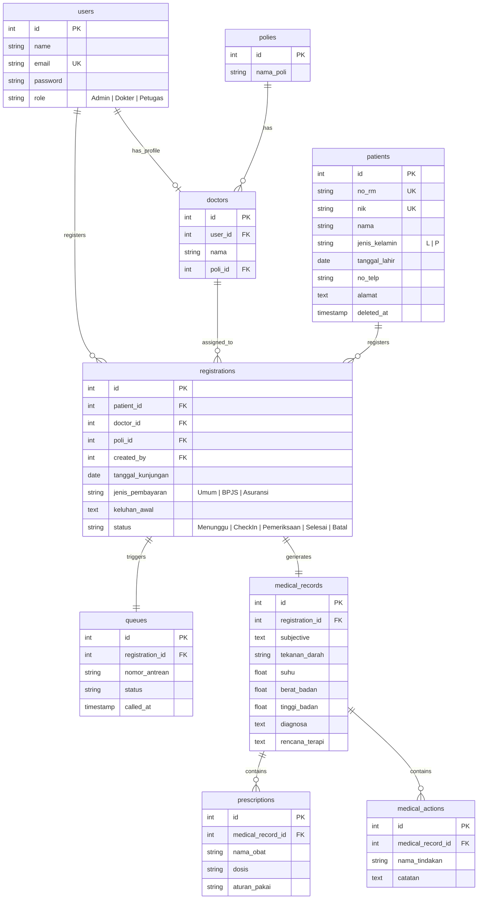

# Product Requirements Document (PRD)
## Sistem Informasi Klinik Pratama

| Metadata | Keterangan |
|---|---|
| **Dokumen** | PRD v1.0 (Final - Approved for Development) |
| **Konteks** | Technical Assignment — Take Home Test Programmer |
| **Referensi Utama** | 1. Technical Assignment Nexa PDF<br>2. SDLC Plan & Technical Architecture v1.0 |
| **Status** | Approved & Locked for Implementation |
| **Tanggal** | Juli 2026 |

---

## 1. Pendahuluan & Ringkasan Eksekutif

### 1.1 Latar Belakang
Klinik Pratama saat ini masih mengandalkan proses operasional manual untuk menangani alur pelayanan pasien. Dampak dari sistem manual ini meliputi:
*   Antrean pasien yang tidak teratur dan sulit dipantau.
*   Penyimpanan data pasien yang tersebar, meningkatkan risiko redundansi data.
*   Kesulitan dokter dalam mengakses riwayat pemeriksaan medis (*medical history*) pasien secara cepat dan terintegrasi.

### 1.2 Tujuan Produk
Membangun **Sistem Informasi Klinik Pratama** — sebuah aplikasi web terintegrasi yang mendigitalkan seluruh alur pelayanan klinik dari hulu ke hilir:

**Pendaftaran Pasien** ➔ **Antrean Harian** ➔ **Pemeriksaan Dokter (SOAP)** ➔ **Pencatatan Resep & Tindakan**

Sistem ini dilengkapi dengan Dashboard Analitik Ringkas untuk memantau produktivitas pelayanan harian secara real-time.

### 1.3 Ruang Lingkup (Scope)
Untuk memastikan penyelesaian dalam batas waktu yang ditentukan (± 3 Hari Kerja), batas ruang lingkup didefinisikan secara tegas:

#### In-Scope (6 Modul Utama)
1.  **Authentication & Role-Based Authorization:** Login stateless menggunakan JWT dengan 3 tingkat role akses (Administrator, Petugas Pendaftaran, Dokter).
2.  **Master Data Pasien:** Manajemen data dasar pasien (CRUD) dengan nomor rekam medis otomatis (*auto-generated*).
3.  **Pendaftaran Kunjungan:** Pencatatan pendaftaran pasien ke dokter spesifik pada poli tujuan tertentu.
4.  **Manajemen Antrean:** Pembuatan, pemanggilan, dan pembaruan status antrean secara harian.
5.  **Pemeriksaan SOAP Dokter:** Pencatatan hasil pemeriksaan medis terstruktur (Subjective, Objective, Assessment, Plan), tindakan, dan resep obat.
6.  **Dashboard Operasional:** Visualisasi ringkas indikator performa utama (KPI) klinik pada hari berjalan.

#### Out-of-Scope
*   Modul pembayaran/kasir lanjutan (*billing system* komprehensif) — hanya mencatat metode pembayaran secara referensial.
*   Integrasi dengan pihak ketiga (seperti BPJS Kesehatan / asuransi komersial komprehensif).
*   Fitur notifikasi real-time menggunakan WebSockets atau SMS/Push Notification gateway.
*   Modul inventori obat dan manajemen rantai pasok farmasi.
*   Sistem multi-cabang (*multi-tenant*).

---

## 2. User Roles & Access Control Matrix

Aplikasi menerapkan kontrol akses berbasis peran (*Role-Based Access Control* / RBAC) untuk menjaga kerahasiaan data medis pasien.

| Peran (Role) | Deskripsi | Hak Akses Utama |
|---|---|---|
| **Administrator** | Penanggung jawab sistem dan pengawas operasional penuh. | • Akses penuh ke seluruh modul sistem (CRUD Pasien, Dokter, Poli, Registrasi, Antrean, dan Dashboard).<br>• Akses baca audit pada riwayat pemeriksaan medis. |
| **Petugas Pendaftaran** | Staf administrasi *front-office* yang menangani kedatangan pasien. | • Manajemen Master Data Pasien.<br>• Pembuatan Pendaftaran Kunjungan & pengelolaan nomor antrean.<br>• Pemantauan Dashboard Operasional. |
| **Dokter** | Staf medis profesional yang melakukan pemeriksaan pasien. | • Memantau antrean pemeriksaan aktif.<br>• Menulis rekam medis SOAP, tindakan, dan resep obat.<br>• Membaca riwayat rekam medis pasien di masa lalu. |

### Matriks Otorisasi Endpoint & Fitur

| Kode Fitur | Modul/Fungsi | Admin | Petugas | Dokter | Keterangan |
|---|---|:---:|:---:|:---:|---|
| **AUTH** | Authentication & Token Verification | ✓ | ✓ | ✓ | Berlaku untuk semua pengguna terdaftar. |
| **PAT-W** | Create/Update/Delete Pasien | ✓ | ✓ | — | Dokter hanya memiliki hak baca pasien. |
| **PAT-R** | Read/Search/Pagination Pasien | ✓ | ✓ | ✓ | Dokter memerlukan akses baca untuk verifikasi pasien. |
| **REG-W** | Pendaftaran Kunjungan Baru | ✓ | ✓ | — | Dikelola penuh oleh front-office. |
| **QUE-M** | Pemanggilan / Pembaruan Antrean | ✓ | ✓ | ✓ | Petugas memanggil di loket, Dokter memanggil ke ruang periksa. |
| **EXM-W** | Input SOAP, Tindakan & Resep | — | — | ✓ | Hak eksklusif Dokter (menjamin integritas data medis). |
| **EXM-R** | Read Riwayat SOAP & Rekam Medis | ✓ | — | ✓ | Petugas Pendaftaran dilarang melihat detail medis pasien. |
| **DSH-R** | View Dashboard Operasional | ✓ | ✓ | — | Membantu koordinasi antrean front-office. |

---

## 3. Asumsi Bisnis & Spesifikasi Logika Sistem

Berdasarkan hasil analisis kebutuhan teknis dan penyelarasan SDLC, keputusan bisnis berikut bersifat final dan mengikat pada sistem:

### 3.1 Siklus Hidup Kunjungan & Pemeriksaan (1:1:1)
Sistem mengunci relasi antara Pendaftaran Kunjungan, Antrean, dan Pemeriksaan Dokter secara linier:
*   Setiap **1 Pendaftaran Kunjungan** (*Registration*) hanya memicu **1 Antrean** (*Queue*) dan menghasilkan **1 Rekam Medis** (*Medical Record*).
*   Pasien yang membutuhkan kontrol ulang atau pemeriksaan di poli lain di hari yang sama harus melalui proses pendaftaran kunjungan baru yang terpisah.

### 3.2 Siklus Hidup & Format Antrean
*   **Format Nomor Antrean:** Menggunakan format sequential alfanumerik `A001`, `A002`, `A003`, dst.
*   **Logika Reset:** Nomor antrean di-reset kembali ke `001` setiap hari pada pukul `00:00` waktu server.
*   **Skala Antrean:** Nomor antrean digenerate secara global (satu antrean untuk seluruh klinik) untuk menyederhanakan antrean fisik front-office.

### 3.3 Manajemen Data Dokter & Poli (Static Master Data)
Untuk mempercepat siklus development ± 3 hari, sistem membatasi kompleksitas manajemen data dokter dan poli:
*   Tidak ada modul CRUD dinamis untuk data Dokter dan Poli pada fase awal.
*   Data Dokter dan Poli disediakan melalui mekanisme **Database Seeding** (data bawaan saat instalasi sistem) dan didokumentasikan di file `README.md`.
*   Poli asal pasien ditentukan secara otomatis (*auto-derived*) berdasarkan poli penempatan dokter yang dipilih pada saat pendaftaran, guna mencegah ketidakcocokan data (*data mismatch*).

### 3.4 Mekanisme Autentikasi Stateless
*   Sistem menggunakan token JWT (*JSON Web Token*) yang disimpan pada sisi client (seperti `localStorage` atau `HttpOnly Cookies`).
*   Proses **Logout** ditangani secara stateless dengan menghapus token dari penyimpanan client. Endpoint `/logout` disediakan di backend sebagai standard kontrak API dan memfasilitasi integrasi *blacklist* token di masa mendatang.

---

## 4. Spesifikasi Fungsional Modul

### 4.1 Modul 1: Authentication & Authorization (AUTH)
*   **Tujuan:** Mengamankan akses sistem dan melakukan routing UI berdasarkan hak akses role.
*   **Persyaratan Fungsional:**
    *   `AUTH-01`: Login menggunakan kombinasi email dan password terdaftar. Kembalian berupa JWT yang mengenkapsulasi data identitas dan role user.
    *   `AUTH-02`: Validasi token di setiap request ke endpoint yang dilindungi (*protected route*). Jika tidak valid/kedaluwarsa, kembalikan HTTP `401 Unauthorized`.
    *   `AUTH-03`: Validasi role di level backend (*Role Guard Middleware*). Jika tidak berwenang, kembalikan HTTP `403 Forbidden`.
    *   `AUTH-04`: Penyimpanan password di database wajib melalui proses hashing satu arah menggunakan algoritma `bcrypt` (work factor minimum: 10).

### 4.2 Modul 2: Master Data Pasien (PAT)
*   **Tujuan:** Mengelola data identitas pasien sebagai fondasi rekam medis.
*   **Persyaratan Fungsional:**
    *   `PAT-01`: Penambahan data pasien dengan field wajib: NIK, Nama Pasien, Jenis Kelamin (L/P), Tanggal Lahir, Nomor Telepon, dan Alamat.
    *   `PAT-02`: Nomor Rekam Medis (No. RM) harus digenerate otomatis oleh sistem dengan format sekuensial yang konsisten (contoh: `RM00001`, `RM00002`). Format tidak boleh diinput manual dan bersifat unik.
    *   `PAT-03`: Validasi NIK unik secara ketat di backend. Duplikasi NIK akan memicu error HTTP `409 Conflict`.
    *   `PAT-04`: No. RM dan NIK bersifat *read-only* setelah data disimpan untuk menjaga konsistensi data historis.
    *   `PAT-05`: Penghapusan data pasien menerapkan metode **Soft Delete** (`deleted_at` timestamp). Data yang dihapus secara lunak tidak akan muncul di daftar pencarian pasien aktif, namun riwayat rekam medis lama pasien tersebut tetap dipertahankan dalam database untuk kepentingan legalitas medis.
    *   `PAT-06`: Halaman indeks pasien wajib mendukung pencarian (*search*) berdasarkan parameter Nama, NIK, atau No. RM, serta wajib menerapkan **Pagination** (parameter `page` dan `limit`) untuk optimalisasi performa query database.

### 4.3 Modul 3: Pendaftaran Kunjungan (REG)
*   **Tujuan:** Mencatat administrasi kedatangan pasien ke dokter tertentu.
*   **Persyaratan Fungsional:**
    *   `REG-01`: Pembuatan kunjungan baru dengan input: Pasien (dari data master yang ada), Dokter (termasuk Poli yang otomatis terhubung), Tanggal Kunjungan, Keluhan Awal, dan Jenis Pembayaran (Dropdown referensi: `Umum`, `BPJS`, `Asuransi`).
    *   `REG-02`: Status pendaftaran kunjungan harus mengikuti alur state machine yang ketat: 
        
        `Menunggu` ➔ `Check In` ➔ `Pemeriksaan` ➔ `Selesai`
        
        Perubahan status harus berurutan (tidak boleh melompati fase).
    *   `REG-03`: Menyediakan opsi pembatalan status (`Batal`) yang hanya bisa diaktifkan apabila status kunjungan berada pada tahap `Menunggu` atau `Check In`. Jika sudah masuk tahap `Pemeriksaan`, pendaftaran tidak dapat dibatalkan.
    *   `REG-04`: Penyaringan (*filtering*) daftar registrasi berdasarkan Parameter Tanggal Kunjungan dan Status.

### 4.4 Modul 4: Manajemen Antrean (QUE)
*   **Tujuan:** Mengatur urutan antrean pasien di ruang tunggu dan sinkronisasinya dengan status pelayanan.
*   **Persyaratan Fungsional:**
    *   `QUE-01`: Generate nomor antrean secara otomatis sesaat setelah pendaftaran kunjungan disimpan (`REG-01`).
    *   `QUE-02`: Menyediakan dashboard/list antrean hari berjalan terurut berdasarkan nomor terkecil yang belum dilayani.
    *   `QUE-03`: Aksi memanggil antrean (*call*) yang mencatat timestamp panggilan (`called_at`) dan memperbarui status antrean/kunjungan menjadi `Check In`.
    *   `QUE-04`: Sinkronisasi status: Jika antrean diperbarui statusnya oleh dokter saat mulai memeriksa, status registrasi otomatis sinkron menjadi `Pemeriksaan`.

### 4.5 Modul 5: Pemeriksaan SOAP & Rekam Medis (EXM)
*   **Tujuan:** Memfasilitasi dokter untuk mencatat hasil pemeriksaan medis secara terstruktur.
*   **Persyaratan Fungsional:**
    *   `EXM-01`: Input terstruktur data SOAP:
        *   **Subjective (S):** Keluhan yang dirasakan pasien.
        *   **Objective (O):** Tanda vital klinis meliputi Tekanan Darah (mmHg), Suhu Tubuh (°C), Berat Badan (kg), dan Tinggi Badan (cm).
        *   **Assessment (A):** Hasil diagnosis dokter.
        *   **Plan (P):** Rencana terapi atau instruksi lanjutan.
    *   `EXM-02`: Pencatatan Tindakan Medis yang dilakukan (nama tindakan dan catatan tindakan).
    *   `EXM-03`: Pencatatan Resep Obat (nama obat, dosis, aturan pakai). Mendukung relasi 1 rekam medis ke banyak obat (*1-to-Many*).
    *   `EXM-04`: Penyimpanan Rekam Medis bersifat final. Sekali disimpan, data medis terkunci (tidak dapat diubah/dihapus) dan mengubah status kunjungan terkait menjadi `Selesai` secara otomatis.
    *   `EXM-05`: Riwayat rekam medis komprehensif pasien dapat diakses oleh dokter berdasarkan `patient_id` dengan urutan dari kunjungan terbaru (*descending order*).

### 4.6 Modul 6: Dashboard Operasional (DSH)
*   **Tujuan:** Memberikan informasi visual cepat mengenai operasional klinik hari berjalan.
*   **Persyaratan Fungsional:**
    *   `DSH-01`: Metrik akumulasi total pasien terdaftar dalam sistem (kecil dari yang ter-softdelete).
    *   `DSH-02`: Jumlah pasien baru yang didaftarkan pada hari berjalan.
    *   `DSH-03`: Jumlah total nomor antrean yang digenerate pada hari berjalan.
    *   `DSH-04`: Jumlah antrean aktif yang berstatus menunggu pelayanan (`Menunggu` / `Check In`).
    *   `DSH-05`: Jumlah kunjungan yang berhasil diselesaikan hari ini (`Selesai`).

---

## 5. Spesifikasi Teknis & Integrasi API

### 5.1 Format Response Standar
Seluruh endpoint menggunakan format response yang konsisten sesuai instruksi penugasan:

#### Success Response
```json
{
  "success": true,
  "message": "Success",
  "data": {}
}
```

#### Error Response
```json
{
  "success": false,
  "message": "Validation Error",
  "errors": {}
}
```

### 5.2 Standar Endpoint API Minimum
Tabel berikut merangkum kontrak HTTP route minimum yang wajib disediakan oleh backend:

| Modul | Method | Route | Hak Akses Role | Keterangan |
|---|---|---|---|---|
| **Authentication** | POST | `/login` | Publik | Autentikasi user & issue JWT token |
| | POST | `/logout` | All Roles | Stateless logout client-side |
| **Patient** | GET | `/patients` | Admin, Petugas, Dokter | List pasien dengan search & pagination |
| | GET | `/patients/:id` | Admin, Petugas, Dokter | Detail profil pasien |
| | POST | `/patients` | Admin, Petugas | Registrasi pasien baru |
| | PUT | `/patients/:id` | Admin, Petugas | Update data pasien |
| | DELETE | `/patients/:id` | Admin, Petugas | Soft delete pasien |
| **Registration** | GET | `/registrations` | Admin, Petugas, Dokter | Filter daftar pendaftaran kunjungan |
| | POST | `/registrations` | Admin, Petugas | Pendaftaran kunjungan baru + trigger queue |
| | PUT | `/registrations/:id` | Admin, Petugas | Update status kunjungan manual |
| **Queue** | GET | `/queues` | Admin, Petugas, Dokter | Daftar antrean hari berjalan |
| | POST | `/queues` | Admin, Petugas | Trigger pembuatan antrean manual |
| | PUT | `/queues/:id/call` | Admin, Petugas, Dokter | Panggil antrean (ubah status ke Check In) |
| | PUT | `/queues/:id/status` | Admin, Petugas, Dokter | Update status antrean |
| **Medical Record** | POST | `/medical-records` | Dokter | Submit SOAP + Tindakan + Resep |
| | GET | `/medical-records/:patientId` | Admin, Dokter | Riwayat rekam medis per pasien |
| **Prescription** | POST | `/prescriptions` | Dokter | Submit resep obat |
| | GET | `/prescriptions/:id` | Admin, Dokter | Detail resep obat spesifik |

> **Catatan:** Dalam implementasi kode, endpoint di atas dipetakan langsung pada root level router atau dapat menggunakan prefix opsional (seperti `/api`) selama konvensi penamaan path tetap konsisten dengan kontrak rujukan di atas.

---

## 6. Desain Database & Skema Relasi

### 6.1 Entity Relationship Diagram (ERD) Blueprint
Rancangan basis data didesain untuk menjamin integritas data referensial medis dengan skema berikut:


```

---

## 7. Arsitektur Perangkat Lunak (Software Architecture)

Untuk menjamin kemudahan pengujian dan pemeliharaan kode (*maintainability*), struktur kode diatur dengan arsitektur standar industri berikut:

### 7.1 Backend: Layered Architecture (3-Tier Pattern)
Backend Node.js (Express.js) memisahkan tanggung jawab kode ke dalam 4 lapisan independen (*Separation of Concerns*):
1.  **Routing Layer (`routes/`):** Mendefinisikan endpoint URL dan mengarahkan ke controller dengan menempelkan middleware validasi & otorisasi.
2.  **Controller Layer (`controllers/`):** Menangani *request-response lifecycle* HTTP. Mengekstrak payload request, memanggil Service Layer, dan mengembalikan format standard response.
3.  **Service Layer (`services/`):** Pusat aturan bisnis (*core business logic*). Contoh: kalkulasi reset nomor antrean harian, pengecekan NIK duplikat, formatting No. RM.
4.  **Repository/Model Layer (`repositories/` / `models/`):** Berinteraksi langsung dengan database server menggunakan SQL Query Builder/ORM (PostgreSQL atau MySQL).

### 7.2 Frontend: Feature-Based Architecture
Frontend React.js distrukturkan berbasis fitur (*domain-driven feature structure*), bukan berbasis tipe file teknis. Hal ini membuat pengembangan per modul menjadi independen dan rapi:
*   Setiap direktori fitur (`src/features/<nama-fitur>`) menampung semua aset terkaitnya seperti: Halaman UI (`pages/`), Komponen UI Mikro (`components/`), API Calls (`api.js`), dan React Hooks spesifik (`hooks.js`).
*   Menggunakan *Route Guard Component* di level routing React untuk mengamankan akses halaman agar pengguna tidak dapat masuk ke dashboard atau form medis yang tidak sesuai dengan role JWT mereka.

---

## 8. Stack Teknologi & Spesifikasi Dependensi

Untuk memastikan aplikasi dibangun dengan standar industri yang tinggi, memiliki validasi data yang ketat, serta efisien untuk diselesaikan dalam batas waktu yang ditentukan, berikut adalah teknologi dan pustaka (*libraries*) pendukung yang disepakati:

### 8.1 Stack Teknologi Utama (Mandatory)
*   **Frontend:** React.js (v18+) — Library JavaScript utama untuk membangun antarmuka pengguna berbasis komponen (*Single Page Application*).
*   **Backend:** Node.js (v18+) dengan Express.js (v4+) — Framework server-side minimalis dan fleksibel untuk mengimplementasikan REST API.
*   **Database:** MySQL — RDBMS relasional untuk menjamin integritas relasi antar entitas (Foreign Keys).
*   **Authentication:** JSON Web Token (JWT) — Protokol autentikasi terenkripsi stateless untuk pertukaran token keamanan.
*   **Version Control:** Git — Alat pelacakan riwayat commit secara berkala.

### 8.2 Library Pendukung & Pemilihan Dependensi
Pemilihan package di bawah ini disesuaikan untuk menjamin kecepatan development, struktur kode yang bersih, serta kemudahan *data validation* dan *data fetching*:

| Nama Package | Peran & Kegunaan | Alasan Pemilihan & Arsitektur |
|---|---|---|
| **Drizzle ORM** | Object-Relational Mapping & Query Builder | ORM yang sangat ringan (*low-overhead*), menggunakan skema deklaratif berbasis JavaScript, dan memudahkan penulisan migrasi database SQL relasional dibanding ORM berat seperti Prisma/TypeORM. |
| **Tailwind CSS** | CSS Styling Utility Framework | Menyediakan utility class untuk styling UI secara cepat, responsif, dan konsisten tanpa boilerplate file CSS eksternal. |
| **shadcn/ui** | UI Component Library (Primitif & Aksesibel) | Kumpulan komponen antarmuka siap pakai (seperti Table, Dialog, Form, Input, Button) yang dibangun di atas Radix UI dan di-style menggunakan Tailwind CSS. |
| **TanStack Query** | Manajemen State Asinkron & Caching | Memudahkan sinkronisasi data frontend dengan backend secara berkala (polling REST API untuk antrean pasien) tanpa kompleksitas integrasi WebSocket. |
| **Zod** | Skema Validasi Data Terpadu | Digunakan secara terintegrasi baik di sisi backend (validasi input API payload) maupun di sisi frontend (resolver skema formulir). |
| **React Hook Form** | Pengelolaan Formulir Frontend | Meminimalkan *render-overhead* pada form input dan diintegrasikan langsung dengan parser schema dari `Zod` (`@hookform/resolvers/zod`). |
| **bcrypt** | Enkripsi Kredensial Pengguna | Standar enkripsi satu arah (*salted-hashing*) untuk menyimpan password pengguna dengan aman di database. |
| **jsonwebtoken** | Token Generation & Verification | Library standard industri untuk membuat (sign) dan mengurai (verify) JWT bearer token pada otorisasi API. |
| **express-async-errors** | Global Route Async Wrapper | Mengeliminasi kebutuhan *try-catch block* berulang pada middleware Express, mengarahkan error asinkron secara otomatis ke error-handler terpusat. |
| **cors** | Cross-Origin Resource Sharing | Middleware wajib di Express untuk mengatur dan mengamankan komunikasi lintas-origin (frontend port ↔ backend port). |
| **dotenv** | Environment Variables Loader | Menghindari penyimpanan konfigurasi sensitif (JWT secret & DB URL) secara langsung (*hardcoded*) di source code. |
| **React Router** | Client-Side Routing | Framework standard navigasi di React SPA, yang memfasilitasi pembuatan *role-based route guards*. |
| **Axios** | HTTP Client | Menggunakan instance interceptor terpusat untuk menempelkan JWT token secara otomatis pada setiap request HTTP. |
| **date-fns** | Utilitas Manipulasi Tanggal | Pustaka manipulasi tanggal yang sangat ringan dan modular untuk menangani format registrasi kunjungan dan logika reset antrean harian. |

---

## 9. Spesifikasi Non-Fungsional & Keamanan Data

### 9.1 Keamanan Sistem (Security)
*   **Enkripsi Sensitif:** Kunci JWT secret, port database, dan kredensial akses tidak boleh ditulis secara langsung pada kode (*hardcoded*). Wajib disimpan menggunakan berkas `.env` dan melampirkan `.env.example` sebagai referensi setup.
*   **Hashing Kredensial:** Seluruh password user wajib ter-hash di database menggunakan pustaka aman `bcrypt`.
*   **Sanitisasi Input:** Mencegah celah keamanan SQL Injection dan XSS dengan menerapkan validasi tipe data yang ketat pada sisi backend menggunakan skema validator (seperti `Zod` atau `Joi`).

### 9.2 Skalabilitas & Performa
*   **Database Query Optimization:** Menambahkan indeks database (*indexing*) pada kolom pencarian utama seperti `patients.nik` dan `patients.no_rm` untuk mempercepat proses pencarian data pasien skala besar.
*   **Pagination Efisien:** Membatasi jumlah record data pasien yang ditarik per query ke database menggunakan mekanisme *offset pagination* pada API `GET /api/patients`.

---

## 10. Deliverables & Kriteria Keberhasilan (Acceptance Checklist)

Berdasarkan dokumen teknis perusahaan, deliverable proyek dinyatakan lengkap dan siap direview apabila mencakup poin-poin berikut:

- [ ] **Source Code Frontend:** Menggunakan React.js terstruktur, rapi, dan responsif.
- [ ] **Source Code Backend:** Node.js (Express.js) dengan penerapan Layered Architecture yang bersih.
- [ ] **Basis Data (.sql):** Skema database SQL lengkap dengan relasi foreign key dan tabel master awal (seeding).
- [ ] **Entity Relationship Diagram (ERD):** Diagram visual relasi tabel database (misal format PNG/PDF atau embedded di README).
- [ ] **Postman Collection:** Daftar request API lengkap dengan contoh payload sukses, gagal validasi, dan otorisasi error.
- [ ] **File .env.example:** Template konfigurasi environment variables tanpa informasi rahasia.
- [ ] **Repository Git (GitHub/GitLab):** Riwayat commit bertahap (minimal 15+ commit log deskriptif) yang menggambarkan progres pengerjaan harian (bukan 1 commit besar di akhir).
- [ ] **Dokumentasi README.md:** Panduan instalasi lokal, inisialisasi database, akun login dummy, struktur direktori proyek, dan daftar asumsi bisnis yang diambil.
- [ ] **Video Demonstrasi:** Rekaman layar (maksimal 10 menit) yang mendemonstrasikan alur kerja aplikasi secara *end-to-end* sesuai alur pelayanan klinik.
